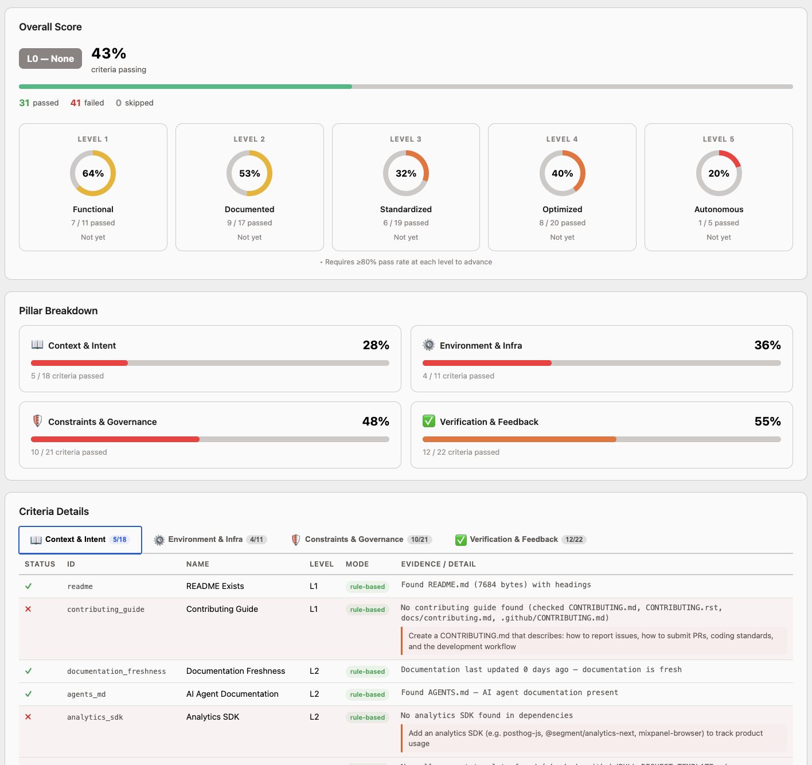

# ari — Agent Readiness Index

> Evaluate how ready your codebase is for AI coding agents.

## What is ari?

ari scans a local repository and evaluates it across 72 criteria in 4 pillars,
assigning a maturity level from 1 (Functional) to 5 (Autonomous).

### Objective

The goal of ari is to give teams a clear, actionable picture of how well their codebase supports AI-assisted development. By scoring repositories across four pillars — **Context & Intent**, **Environment & Infra**, **Constraints & Governance**, and **Verification & Feedback** — ari identifies gaps that slow down AI coding agents and provides concrete suggestions to close them. The end result is a codebase that both humans and AI agents can navigate, build, and ship in confidently.

### Example Report

<p align="center">
  
</p>

## Installation

### From source
```bash
go install github.com/nixbpe/ari/cmd/ari@latest
```

### Build locally
```bash
git clone https://github.com/nixbpe/ari
cd ari
go build ./cmd/ari
```

## Quick Start

```bash
# Evaluate current directory (interactive TUI)
ari --path .

# JSON output
ari --path . --output json

# HTML report
ari --path . --output html --out report.html

# Skip LLM evaluation
ari --path . --no-llm
```

## CLI Flags

| Flag | Default | Description |
|------|---------|-------------|
| `--path` | (required) | Path to repository to evaluate |
| `--output` | `tui` | Output format: `tui`, `json`, `html`, `text` |
| `--out` | | Output file path (for html/json/text) |
| `--no-llm` | false | Skip LLM evaluation, use rule-based only |
| `--level-detail` | false | Show per-level breakdown in text output |
| `--version` | | Print ari version |
| `--help` | | Show usage |

## Maturity Levels

| Level | Name | Description |
|-------|------|-------------|
| 1 | Functional | Basic tooling in place |
| 2 | Documented | Code and processes documented |
| 3 | Standardized | Consistent standards enforced |
| 4 | Optimized | Performance and quality optimized |
| 5 | Autonomous | Fully ready for AI agents |

Progression is gated: you must achieve >=80% at each level before advancing.

## Criteria Reference

### Context & Intent (18 criteria)
| ID | Level | Description |
|----|-------|-------------|
| contributing_guide | L1 | Checks that a CONTRIBUTING.md or equivalent guide exists to help contributors understand the workflow |
| readme | L1 | Checks that a README file exists and has meaningful content (50+ chars with headings) |
| agents_md | L2 | Checks for AI agent documentation files (AGENTS.md, CLAUDE.md, .cursor/rules, etc.) |
| analytics_sdk | L2 | Checks that an analytics SDK (Segment, Mixpanel, Amplitude, PostHog, RudderStack) is present in dependencies |
| documentation_freshness | L2 | Checks that documentation files (README, CONTRIBUTING, AGENTS) have been updated within 180 days |
| issue_templates | L2 | Checks that issue templates exist in .github/ISSUE_TEMPLATE/ to guide contributors in reporting bugs and requesting features |
| pr_template | L2 | Checks that a pull request template exists to standardize PR descriptions and checklists |
| api_schema_docs | L3 | Checks for OpenAPI/Swagger spec or GraphQL schema files documenting the repository API |
| agentic_development | L3 | Checks for AI agent documentation files that guide automated development tools |
| experiment_infrastructure | L3 | Checks for A/B testing or feature flag SDKs (GrowthBook, Statsig, Optimizely, Split, LaunchDarkly) |
| issue_labeling_system | L3 | Checks that a labels configuration file exists to standardize issue and PR labeling |
| service_flow_documented | L3 | Checks for architecture diagrams (.puml, .mmd, .drawio, .excalidraw) or docs/architecture directories |
| tracking_plan_docs | L3 | Checks for a tracking plan document (docs/tracking-plan.md, avo.json, .avo/) defining analytics events |
| skills | L4 | Checks for AI skill files in .claude/skills/ or .cursor/ that teach agents project workflows |
| automated_doc_generation | L4 | Checks for automated documentation generation tooling (godoc, typedoc, javadoc, etc.) |
| backlog_structure_docs | L4 | Checks that backlog/process documentation exists describing how work is prioritized, triaged, and structured |
| error_to_insight_pipeline | L4 | Checks for error reporting pipelines: Sentry CLI in CI workflows, sentry.properties config, or automated issue creation |
| product_metrics_docs | L4 | Checks that product metrics, KPIs, or north-star metrics are documented |

### Environment & Infra (11 criteria)
| ID | Level | Description |
|----|-------|-------------|
| build_cmd_doc | L1 | Checks that build commands are documented in project files |
| deps_pinned | L1 | Checks for a dependency lock file to ensure reproducible builds |
| env_template | L1 | Checks that a .env.example or similar template documents required environment variables |
| devcontainer | L2 | Checks that a devcontainer configuration is present for reproducible development environments |
| version_pinning | L2 | Checks that the runtime/SDK version is pinned via .nvmrc, .python-version, .tool-versions, or similar |
| single_command_setup | L2 | Checks for a single command to set up the development environment |
| ide_config | L3 | Checks that IDE configuration files are committed for consistent editor settings across the team |
| local_services_setup | L3 | Checks that a docker-compose or compose file is present for running local services |
| database_schema | L4 | Checks that database schema or migrations are defined and tracked in version control |
| devcontainer_quality | L4 | Evaluates the quality of devcontainer configuration including postCreateCommand, features, and extensions |
| vcs_cli_tools | L5 | Checks for VCS CLI tooling such as GitHub CLI (gh) configured in the project |

### Constraints & Governance (21 criteria)
| ID | Level | Description |
|----|-------|-------------|
| formatter | L1 | Checks for code formatter configuration |
| gitignore_comprehensive | L1 | Checks that .gitignore exists and covers at least 3 security-sensitive patterns |
| lint_config | L1 | Checks for linter configuration file |
| security_policy | L1 | Checks that a SECURITY.md file exists describing how to report vulnerabilities |
| type_check | L1 | Checks for static type checking configuration |
| codeowners | L2 | Checks that a CODEOWNERS file exists to define code ownership |
| dep_update_automation | L2 | Checks that automated dependency updates are configured (Dependabot or Renovate) |
| naming_consistency | L2 | Checks that naming conventions are consistent across the codebase |
| pre_commit_hooks | L2 | Checks if pre-commit hooks are configured for the project |
| strict_typing | L2 | Ensures strict type checking is enabled for the project language |
| cyclomatic_complexity | L3 | Checks for cyclomatic complexity analysis tools in project configuration |
| dead_code_detection | L3 | Checks for dead code detection tools in project configuration |
| sast_config | L3 | Checks that static application security testing (SAST) is configured via config file or CI |
| secret_scanning_config | L3 | Checks that secret scanning is configured via a config file or CI workflow step |
| automated_pr_review | L4 | Checks for automated PR review configuration including CODEOWNERS, bots, and CI PR triggers |
| code_modularization | L4 | Checks for module boundary enforcement patterns |
| dependency_audit_ci | L4 | Checks that dependency vulnerability auditing runs in CI (npm audit, govulncheck, trivy, snyk, etc.) |
| duplicate_code_detection | L4 | Checks for duplicate code detection tools in project configuration |
| large_file_detection | L5 | Checks for large file detection and prevention tools |
| tech_debt_tracking | L5 | Checks for tech debt tracking and TODO enforcement |
| unused_dependencies_detection | L5 | Checks that unused dependency detection is configured |

### Verification & Feedback (22 criteria)
| ID | Level | Description |
|----|-------|-------------|
| unit_tests_exist | L1 | Checks that unit test files exist in the repository |
| health_checks | L2 | Checks that health check endpoints are defined in source files |
| structured_logging | L2 | Checks for a structured logging library in dependencies |
| test_naming_conventions | L2 | Checks that test files follow language-specific naming conventions |
| unit_tests_runnable | L2 | Checks that test commands are documented in project files |
| distributed_tracing | L3 | Checks for distributed tracing instrumentation in dependencies |
| error_tracking | L3 | Checks for an error tracking service integration in dependencies |
| fast_ci_feedback | L3 | Checks for CI/CD configuration (GitHub Actions, GitLab CI, Jenkins, CircleCI) |
| integration_tests_exist | L3 | Checks for integration or end-to-end tests (directories, config files, or build tags) |
| metrics_collection | L3 | Checks for metrics collection library in dependencies |
| release_automation | L3 | Checks for release automation configuration (goreleaser, release-please, semantic-release) |
| test_coverage_thresholds | L3 | Checks for test coverage threshold configuration of >=80% in CI, build files, or test framework config |
| alerting_configured | L4 | Checks that alerting configuration files are present in the repository |
| build_performance_tracking | L4 | Checks that build caching and performance tracking tools are configured |
| deployment_frequency | L4 | Checks how frequently the project deploys by examining git tag history |
| feature_flag_infrastructure | L4 | Checks that a feature flag library is configured in the project |
| flaky_test_detection | L4 | Checks that flaky test handling (retry/rerun) is configured in CI or test frameworks |
| profiling_instrumentation | L4 | Checks for profiling instrumentation in the codebase |
| release_notes_automation | L4 | Checks that release notes automation is configured |
| test_isolation | L4 | Checks that tests are configured for isolation and parallel execution |
| test_performance_tracking | L4 | Checks that test performance tracking (benchmarks) is configured |
| runbooks_documented | L5 | Checks that operational runbooks are present and contain meaningful content |

## LLM Configuration

ari supports optional LLM evaluation for criteria that benefit from semantic analysis:

```bash
# Anthropic
export ARI_LLM_PROVIDER=anthropic
export ARI_API_KEY=sk-ant-...
ari --path .

# Ollama (local)
export ARI_LLM_PROVIDER=ollama
ari --path .

# Custom model
export ARI_LLM_MODEL=claude-sonnet-4-20250514
ari --path .
```

Without LLM configuration, ari uses rule-based evaluation for all criteria.

## Supported Languages

- Go
- TypeScript / JavaScript
- Java / Kotlin

## Output Formats

### TUI (default)
Interactive terminal UI with progress view, report view, and drill-down detail view.

### JSON
```bash
ari --path . --output json | jq '.level'
```

### HTML
Self-contained HTML report with inline CSS. No external dependencies.

### Text
Plain text output suitable for CI logs and non-TTY environments.

## Contributing

See [AGENTS.md](AGENTS.md) for development setup and architecture overview.
